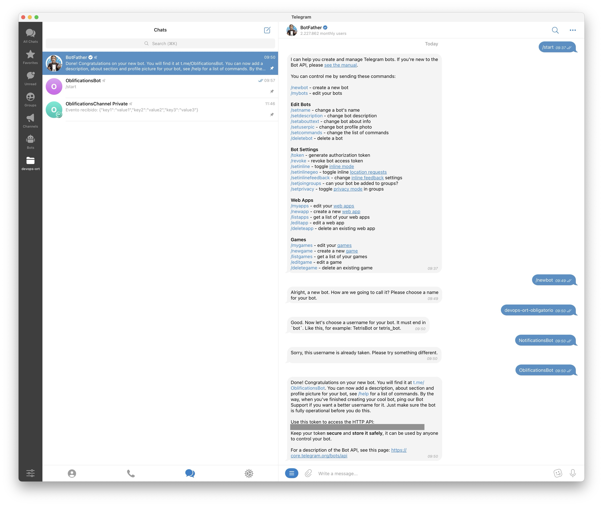
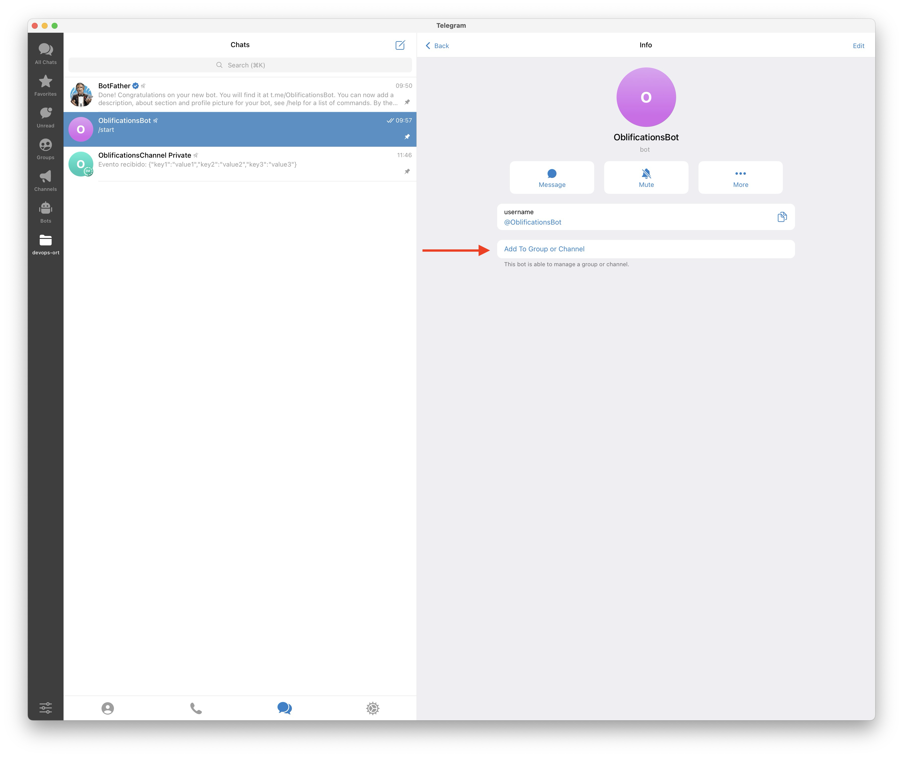
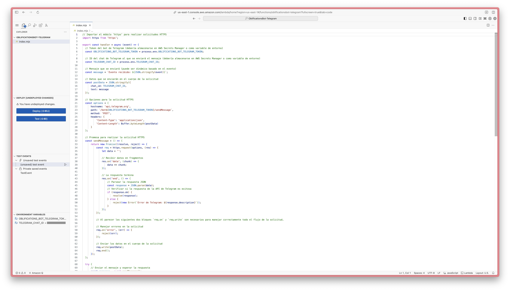
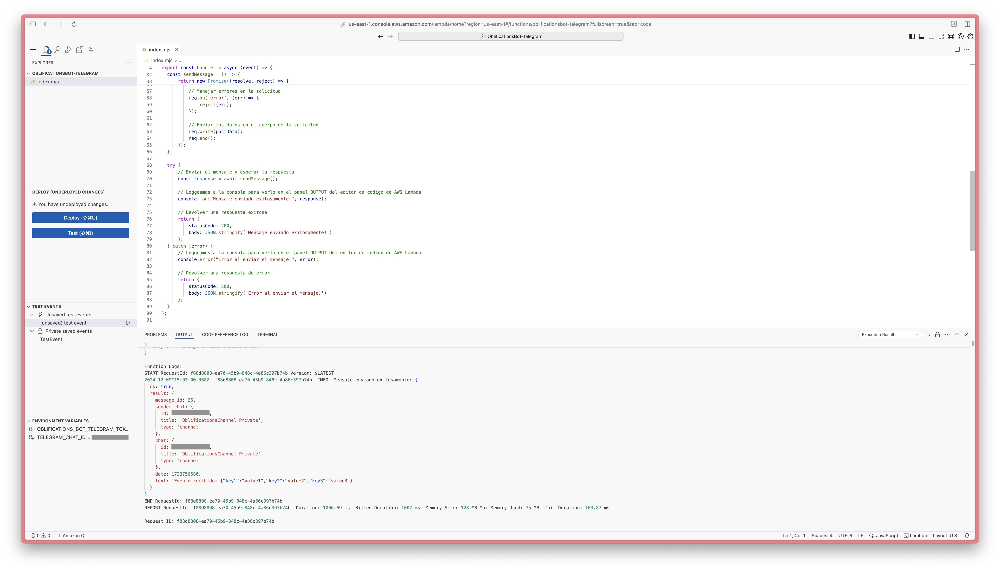
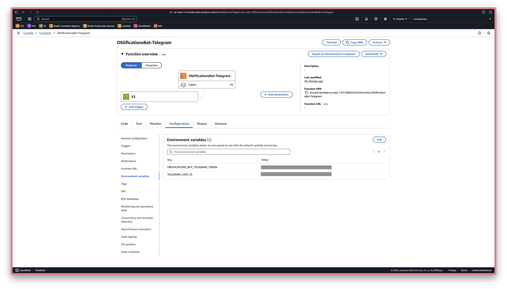
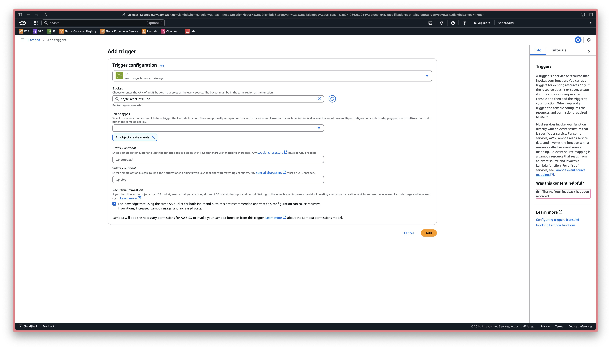
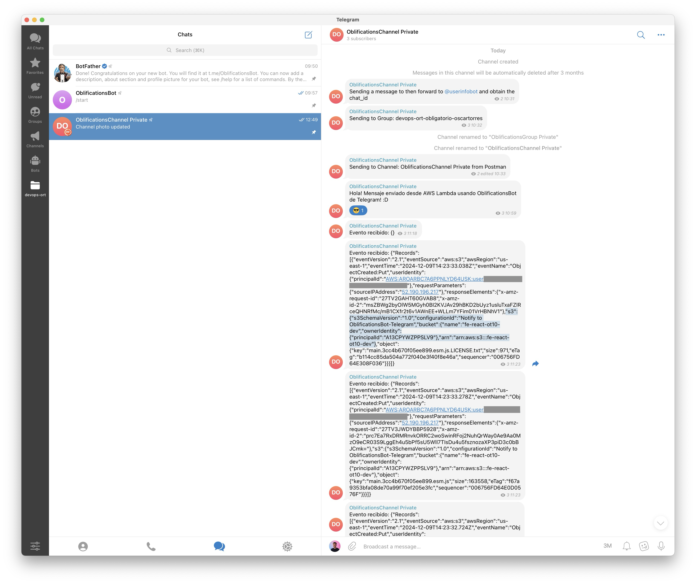
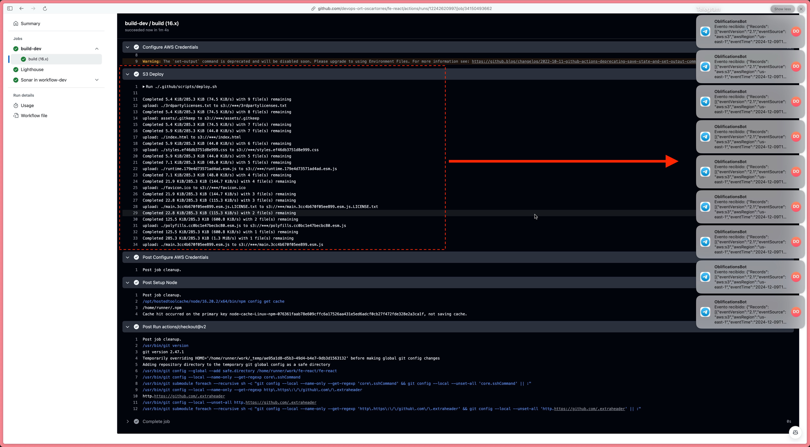

I wanted to talk a bit about my first encounter with a serverless service provided by Amazon Web Services called Lambda. In a few words, it's a managed service that lets you execute code "remotely".

I did this as part of my certification in DevOps at ORT University in the past December, 2024. One of the requirements of the final project was to create any kind of automation with a serverless service.

# What even is Serverless?

You may think, and very understandable so, that it means that there are no servers. And nothing could be further from the truth. Of course there are servers. You just don't manage those servers, the Cloud provider does it for you. That's, in my understanding, a basic definition of a serverless service.

Some key characteristics I learned about serverless services:

- **They scale automatically.** Practically to the infinitum.
- **You pay only for what you use.** That's where the provider business is with this model of cloud computing, the more you use it, the more money they make.
- **You don't handle infrastructure.** It's not that the infra doesn't exist, you just don't manage it, the provider does.
- **High Availability by defect.** You don't have to choose an availability zone.

# What is AWS Lambda?

It's a service that let's you execute code on demand.

Any code snippet you want to, for example some logic that every morning fetches from the BCU API (Uruguay's Central Bank) and obtains the exchange rate. You can store this *in a Lambda* and it will execute whenever you tell it to.

To achieve this, you don't need to configure any servers, it does it automatically. Also, you don't have to build or compile anything for your code. You just write the code and it will execute it, no issues.

I heard you could even host your entire back end of your application in Lambdas, although I'm not sure if that's a good idea. What I'm sure of is someone has already done it.

It's used a lot for automations. One example I remember from the AWS docs is when you have an application that allows the user to upload images, and you may want to have multiple versions of different sizes and resolutions for different devices and parts of the app. You just run the user-uploaded image through a Lambda that implements that logic, and get all the images you need.

It also manages multiple programming languages, you can pick Node, Python, Java, PHP, .NET C#, etc.

The way it triggers can vary:

1. **Manually**. You can run it yourself.
2. **Scheduled**. Pick a date and time.
3. **Conditionally**. "If there is a new object in my ECR repo" it executes.

Finally, and obviously, the integration with the rest of the ecosystem is great, and that takes us to...

# Why I picked AWS Lambda?

It made sense as I was already using multiple other AWS services on my project, and I was curious to know a bit more about the AWS ecosystem, as this was one of my first encounters with it. I also thought it could be very useful for future personal and professional projects.

# The Problem

I wanted to solve something pretty simple: I wanted to receive a Telegram message notification every time a new object got into my S3 bucket.

# The Solution

Overview:

- Add a Lambda with an automation listening to S3 bucket events.
- Use a Telegram Bot to receive the event and send the message.

Let's continue with the step by step[^1].

1. Create the Telegram bot.

 You can use the [@BotFather](https://t.me/BotFather) bot:

2. Add the bot as an admin to a channel or group where we want the messages to be sent. This will give it permissions to send messages.

3. Create Lambda function:

Lambda's function code in a VS Code-like editor in the AWS console:

Lambda's function code with Output:

Add the necessary environment variables in Configuration > Environment variables. In our case it's the bot's token and the id of the chat we want to send the message to.

4. Configure the events we want to be notified of.

For example, on any change to an S3 bucket. In your S3 bucket > Properties > Event notifications. Also you can do the same in the Lambda function via Configuration > Triggers.

Aaand if you followed closely, you should be receiving automated messages in Telegram whenever your S3 bucket changes 😎

Another example of notifications received visualizing our pipeline in GitHub Actions:

# Improvements

An immediately obvious improvement would be the formatting of the event we received to craft a much more concise and easy to read message. Due to time constraints I didn't pursue this as the Lambda was functioning properly and I wanted to polish other parts of the project for delivery.

# Conclusion

Telegram bots are great, and I see myself using them in the future for other use cases. It was real fun automating this, there is something about coding an integration for an app you use regularly that feels good, and kinda "closer".

It will make me smile if this was somewhat useful to you. If it was, let me know, so I can smile. If not, I'll smile anyways.

See you on the next one!

:)

[^1]: The following documentations were very useful to solve the problem: [Bots: An introduction for developers](https://core.telegram.org/bots), [Telegram Bot Features](https://core.telegram.org/bots/features#what-features-do-bots-have), and more specifically for our use case, which is sending a message, the [Telegram Bot API sendMessage method](https://core.telegram.org/bots/api#sendmessage).
