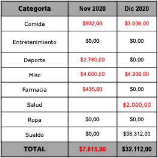
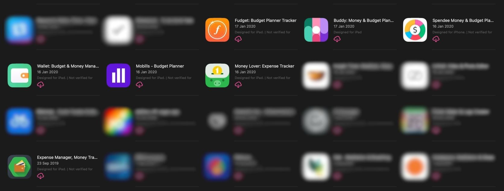

ZetaSoftware. Actualmente utilizo el módulo de Finanzas Personales de la empresa uruguaya ZetaSoftware, y ha sido una de las mejores herramientas que he incorporado en mi vida.

# Un poquito de historia

Mi relación con las finanzas nunca fue una muy profunda, podría decirse. Como la mayoría de personas de mi generación (creo) no recibí educación financiera "formal" ni en primaria, ni en secundaria, ni siquiera en la universidad. Considero esto una enorme falla en nuestro sistema educativo. Una falla... ¿o una funcionalidad más del sistema que nos rige?

A medida que fui creciendo e interesándome más por el software, y me convertí en una persona mucho más organizada y detallista en muchas áreas de mi vida, por ej. adoptando el hábito de tomar notas, y a su vez que comencé a generar mis ingresos propios en 2020, naturalmente llegué a la conclusión de querer llevar un registro de gastos.

Rodrigo Álvarez de Neurona Financiera fue un pilar en mi crecimiento financiero y en todo lo que he aprendido y aplicado, recomiendo ampliamente todo su contenido y su trabajo. Gracias a varios episodios de su podcast fui aprendiendo lo básico sobre finanzas personales como la importancia de un registro de gastos y las inversiones.

# En la práctica

## 2020--2022

Desde 2020 a 2022 llevé mi registro de gastos de una forma que hoy pienso es muy, muy inconveniente. En esa época tenía un fuerte interés por mi privacidad digital, y le daba una altísima importancia a que mi información financiera estuviera encriptada de extremo a extremo y no en la computadora de alguien más, mejor conocida como "la nube".

Este deseo me llevó a comenzar mi registro de gastos en Standard Notes, una aplicación de notas que por defecto encripta de extremo a extremo todo tu contenido. Lo que hacia era día a día ingresar los gastos separados por coma en este formato:

> Fecha, Concepto, Categoria, Monto, Comentarios

Por ejemplo:

> 01/11, Churros en la rambla, Comida, $90, Post-marcha

Este es un ejemplo real del primer gasto que tengo registrado del primero de noviembre de 2020.

Con cada gasto agregaba una nueva línea. Luego al final de cada mes, manualmente copiaba y pegaba este registro en una planilla de cálculo en LibreOffice local en mi computadora y realizaba algunos cálculos básicos:

A simple vista en esa tabla ya hay dos errores, pero no voy a modificar el registro histórico.

Esta manera de llevar mi registro de gastos a mi entender actual tiene algunos pros y muchos contras:

| Pros                                                                                                                                                                        | Contras                                                                                                                                                                                                                                                                                       |
| --------------------------------------------------------------------------------------------------------------------------------------------------------------------------- | --------------------------------------------------------------------------------------------------------------------------------------------------------------------------------------------------------------------------------------------------------------------------------------------- |
| buena privacidad, mis datos financieros están encriptados si tocan un servidor o en mi computadora local                                                                    | mucho trabajo manual.  copiar y pegar de una app a otra todos los meses termina siendo engorroso y consume mucho tiempo                                                                                                                                                                    |
| bastante libertad de hacer lo que quieras al tener la info. en una planilla, podes calcular, graficar, etc., no te restringe a lo que una app te provee      | en ese momento no lo sabía, pero solo estaba llevando registro de -gastos- y para ingresos solo registraba el de mi sueldo...  ¿qué pasa con las transferencias entre cuentas propias o movimientos entre diferentes monedas? ¿cómo sé cuánto tengo en todas mis cuentas de un vistazo? |
|                                                                                                                                                                             | cero automatización, no había forma de registrar gastos recurrentes como suscripciones o facturas mensuales                                                                                                                                                                                   |
|                                                                                                                                                                             | cero estadísticas y análisis automatizados, si quiero visualizar mejor para sacar conclusiones de la info. tengo que hacer cálculos o gráficas yo mismo                                                                                                                                       |

Ya se pueden visibilizar las mayores carencias de este sistema. Para ser honesto, la mayoría de las contras que resalto hoy en junio de 2024, eran problemas que ni siquiera tenía o ni siquiera sabía que tenía. Y eso está bien. Me armé un sistema que funcionaba para mi realidad de ese momento, y me brindó la utilidad que podía durante el tiempo que lo necesité. Seguramente con más dedicación de tiempo y/o conocimientos pudiera resolver algunas de las contras, y fue recién llegando al comienzo de 2022 que ya no estaba cómodo con cómo manejaba mis finanzas.

Decidí ponerme a investigar por opciones de apps especializadas en registro de gastos, y me encontré con un océano de posibilidades. Una simple búsqueda en cualquier tienda de aplicaciones te va a dar cientos de opciones de "finance trackers" y "budget planners". Los descargué todos: Mobils, Wallet, Spendee, Buddy, Money Lover, Expense Manager, Fudget... 

Estas son solo algunas, más abajo y más arriba en esta lista hay más, y se puede ver que la primera fecha de descarga fue en 2019 y 2020, ya había tenido mi primer acercamiento. También consideré otras más populares como YNAB. Ninguna resonó conmigo. Eran todas muy... yankees. 

Las principales fallas o faltas que encontré:

1. muy intrusivas con los planes premium
2. interfaz abrumadora y difícil de entender
3. las funcionalidades no se asemejaban mucho a mi realidad o la de mi país (Uruguay)
4. planes premium muy caros, estaba comenzando con esto y aún no estaba dispuesto a "hacer un gasto para registrar mis gastos"
5. la mayoría no inspiraban confianza en ser un servicio que pudiera estar presente por años

Esta situación me estaba inquietando porque se terminaba el 2021 y aún no encontraba una buena alternativa. Quería comenzar el siguiente año con un nuevo software que me permitiera evolucionar en el manejo de mis finanzas como yo quería. Aún no lo sabía, pero había luz al final del túnel...

## 2022--actualidad 

Verano de 2022. Estaba en la playa y me dispuse a escuchar un buen episodio de podcast. Entro a Spotify y arranco a mirar los posibles shows que tengo en mi biblioteca, siento que quiero escuchar algo de finanzas así que elijo el de Neurona Financiera y miro su larga lista de cientos de episodios… hasta que lo vi: “Como seleccionar una App para el registro de gastos”. Fue un click instantáneo. Bueno, no recuerdo si tan así, pero me imagino que habré entrado rápido.

Devoré el episodio como una fruta luego de un largo ayuno. Resonó muchísimo conmigo. Básicamente expone los puntos básicos que «debería» tener una app, para ayudarte a elegir la correcta para vos, esos son:

1. los datos deberían estar en "la nube"
2. tiene que ser multi moneda
3. permite manejar Saldos
4. permite hacer Ajustes
5. permite definir mis propios Conceptos
6. permite construir un Presupuesto
7. permite hacer Análisis de los datos
8. permite exportar los datos a formato estándar como Excel
9. permite una buena gestión de tarjetas de crédito

Estoy completamente de acuerdo con casi todos los puntos, siendo el primero el que puedo tener alguna diferencia. Comparé estos puntos con cómo estaba llevando mis finanzas con mi sistema anterior y era claro que había mucho para mejorar.

Hacia el final del episodio Rodrigo hace su recomendación: ZetaSoftware. Ahí es cuando conocí por primera vez esta empresa uruguaya de servicios de gestión financiera. Él dice que no era publicidad, y le creo, pero sí que hizo la mejor publicidad que le pudieran haber pedido.

El módulo de Finanzas Personales de ZetaSoftware cumple con cada punto mencionado por Rodrigo, e incluso más. Y si bien pienso que esa lista puede haber salido *luego* de usar ZetaSoftware y no al revés, cayendo en una falacia post hoc o algún sesgo de confirmación, de todas maneras es muy útil para empezar; e ideal para alguien como yo en ese momento.

# Mis casos de uso con ZetaSoftware

## 1. Registro de todos los movimientos de dinero

Soy bastante minucioso y registro cada gasto, ingreso o transferencia de dinero entre mis cuentas. Esto no hace que mi Saldo coincida siempre con lo que realmente tengo, honestamente cuanto más Cuentas he ido agregando más han dejado de coincidir, pero si me da una idea general y siempre puedo hacer un Ajuste.

También, ya lo hago hace suficiente tiempo como para que la mayoría de gastos que tengo sean gastos que ya hice, así que solo los busco y duplico cuando tengo uno nuevo.

Esto también es muy útil para saber cuánto gasté, cuándo y en qué cosas. Ya es algo regular que chequeo a ver cuándo fue la última vez que compré algo y dónde.

> Estás loco, registrando cada movimiento como un obsesivo.

Dependiendo quien lo mire, puede ser... pero la realidad es que es un hábito como cualquier otro, una vez que lo incorporas, lo haces en automático. Mi manera de aplicarlo es, si puedo registrar el gasto en el momento con mi celular, lo hago, si no, siempre pido el ticket de cada movimiento y los voy dejando en mi escritorio cuando llego a casa, y una vez a la semana los anoto. A veces acumulo 5 o 6 tickets y los hago en tandas.

## 2. Presupuesto

Me permite de forma muy fácil hacer un presupuesto para cualquier Concepto específico. Un Concepto es un motivo por el cual sale o ingresa dinero.

En mi caso lo uso principalmente para controlar mis gastos en lo que yo llamo "Alimentación (comer afuera)", esto es todo lo que sea restaurantes, heladería, churros en la rambla 😅, etc. Hace un tiempo sentí que estaba gastando demasiado dinero en esta área y lo quise controlar y me ha servido. 
¿De qué otra forma podría saber que gasté UYU 58.175,71 en comer afuera en 2022? Esa información me ayudó a reflexionar y darme cuenta que no quería gastar tanto, y bajar un poco para 2023.

Así vengo para 2024:

-2024-06-21.png)

Tendrán que adivinar qué pasó en mayo.

## 3. Análisis de finanzas de casa

No vivo solo, y considero que llevar unas finanzas equitativas de un hogar que compartís con alguien está buenísimo. Aprendes mucho, te das uno o más momentos en el mes para analizar cómo viene todo y te hace reflexionar e incluso conectar con la otra persona en un tema que suele ser tabú como lo es el dinero. Es liberador.

Para los gastos que hace la otra persona, por lo general me deja los tickets en el escritorio y yo los anoto cuando puedo, tenemos buena comunicación asíncrona.

A cada gasto que registro le pongo una etiqueta de "Casa Apartamento - persona", y luego simplemente a fin de mes le hago una consulta a esos datos pidiéndole que me de todos los gastos del mes de cada persona, ahí los revisamos, corregimos, hacemos unos cálculos simples y transfiero lo que debo. Listo, finanzas equitativas y hasta el mes que viene.

Ejemplo de consulta para el mes de abril 2024:

Lo mismo hago con viajes, por ejemplo, tengo una etiqueta para cada viaje y cuando termina suelo ver cuánto gasté en el mismo y si me siento bien con eso o quiero ajustar para el siguiente.

## 4. Automatización de movimientos recurrentes

Se pueden configurar gastos e ingresos recurrentes. Lo uso para gastos como suscripciones y facturas de servicios y para ingresos como sueldos mensuales. Esta funcionalidad disminuye el trabajo manual que tengo que hacer y fácilmente deja un registro de dónde chequear todos esos movimientos recurrentes por si quisiera eliminar o disminuir alguno.

## 5. Centralización

Valoro mucho la consistencia y la centralización en prácticamente todo lo que uso. Considero que muchos problemas se pueden facilitar simplemente poniendo toda la información a la vista en un solo lugar. ZetaSoftware te da eso. Gestiono cuentas bancarias, cuentas de efectivo (si, también se llaman cuentas), cuentas de inversión, incluso una cuenta Deudas (que debo) y una Disponibles (que me deben). En un solo lugar tengo un panorama amplio de toda mi situación financiera, y me da la información necesaria para tomar decisiones.

# Algunos fails

No se trata de ser perfecto, se trata de hacer, e ir aprendiendo sobre la marcha. Aprender haciendo. Esta es una mentalidad que siento da muchos frutos y se puede aplicar a todas las áreas de la vida.

En mi viaje con las finanzas, le he pifeado fuerte muchas veces, estas son algunas que recuerdo.

## Perdí plata durante 9 meses

Desde octubre 2021 a junio 2022 hice mal el cálculo del porcentaje que me correspondía pagar de los gastos de la casa. Estaba usando mal la formula que había armado para calcularlo. Y con formula me refiero a una regla de tres. Sí, estaba haciendo mal una regla de tres. Tremendo nabo.

Literalmente perdí plata durante 9 meses y ni cuenta me di. Estaba pagando de más a la persona con la que vivo. Lo bueno es que le debo la vida y más, por lo que no hicimos ninguna devolución retroactiva.

## Inflé mis gastos durante 10 meses

Ya describí cómo hacemos las finanzas en mi casa. Luego de ese proceso siempre me queda a mi transferir lo que debo del mes, y ese movimiento lo anoto en ZetaSoftware para reflejar que salió un monto, por lo general grande, de mi cuenta bancaria.

Resulta que durante 10 meses lo estaba anotando como un Gasto, en vez de una Transferencia.

¿Cuál es el problema con esto? Básicamente estaba duplicando los gastos. 

Lo anotaba como un Gasto y le ponía "Gastos Casa", pero en realidad los gastos de la casa ya se habían hecho, esos son la comida, nafta, alquiler, etc., no la transferencia que haces a fin de mes para quedar a mano, eso simplemente es un movimiento de dinero. 

El problema está en que ZetaSoftware toma en cuenta los Gastos para los análisis, y no las Transferencias.
Por ejemplo, iba a mirar las gráficas y había un gasto grande de UYU 14.572 por concepto de "Gastos Casa". ¿Qué comprenden esos gastos? ¡Si ya los había hecho!

# Cómo empezar

Si crees que llevar un registro de gastos te puede ser útil, van algunos consejos.

- Preguntate, ¿para qué lo quiero hacer? ¿qué quiero mejorar de mis finanzas?
- Simplemente empezá. Si queres agarra una hoja de papel, ponele de titulo el mes y arranca con la lista de gastos.
- No te fuerces a hacerlo de una manera que no te queda cómoda. Si el papel deja de funcionar, busca algún software. Si una app no te convence, busca otra.

# ¿Recomiendo ZetaSoftware?

Sin dudas. A mi además de ayudarme a manejar mis finanzas, me ayudó a *aprender* de finanzas, y ese conocimiento me parece muy valioso.

Estos son algunos pros y contras que he encontrado en estos dos años que la he usado extensivamente:

| Pros                                                                                                                     | Contras                                                                                                                                                                                                                         |
| ------------------------------------------------------------------------------------------------------------------------ | ------------------------------------------------------------------------------------------------------------------------------------------------------------------------------------------------------------------------------- |
| es uruguaya y está adaptada a la realidad de acá, por ejemplo ya viene con algunas cosas pre cargadas que son familiares | esta hecha con GeneXus                                                                                                                                                                                                          |
| completamente gratis $ (*as in beer*)                                                                                    | no luce muy moderna, parece “vieja” la interfaz                                                                                                                                                                                 |
| solución completa, mis finanzas se fueron complejizando cada vez mas los últimos dos años y se ha adaptado a todo        | la app web es un poco lenta y la app movil en iOS es MUY lenta  yo soy exigente pero es usable igual, no es que no sirven, solo que no se compara con otras apps modernas y/o nativas como WhatsApp, Telegram o Instagram |
| documentación de ayuda muy buena                                                                                         | no funciona offline                                                                                                                                                                                                             |
| cada vez que les envié un email me respondió una humana, se que hay personas del otro lado que me pueden ayudar          |                                                                                                                                                                                                                                 |
| es simple de usar una vez que entendes bien los conceptos                                                                |                                                                                                                                                                                                                                 |

# Conclusión

Quería escribir sobre mi experiencia con las finanzas en los últimos años y creo que ya me explayé lo suficiente. Siento que he mejorado mucho y sigo aprendiendo regularmente. No me veo dejando de usar ZetaSoftware en el futuro cercano, tendría que aparecer una alternativa que ofrezca lo mismo y/o más pero con aplicaciones más modernas y rápidas, y creo que recién ahí consideraría migrar.

Ojalá te haya sido útil mi perspectiva y éxitos en tus finanzas, hasta la próxima publicación!
